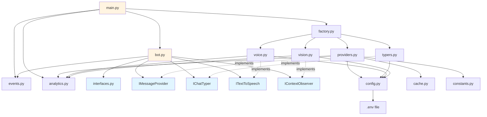

# Component Dependency Diagram

This diagram shows the high-level component relationships and dependencies in the R6 Nice Talker project.

## Component Layers

### Layer 1: Interfaces
- **`src/interfaces.py`**: Defines contracts for all pluggable components
- Enables dependency injection and testability

### Layer 2: Implementations
- **`src/providers.py`**: Message generation (ChatGPT, Fixed, Random)
- **`src/typers.py`**: Chat typing (R6Siege, Debug)
- **`src/voice.py`**: TTS engines (ElevenLabs, pyttsx3)
- **`src/vision.py`**: OCR providers (EasyOCR, Tesseract)

### Layer 3: Infrastructure
- **`src/events.py`**: Event bus for async communication
- **`src/analytics.py`**: Usage tracking and cost calculation
- **`src/cache.py`**: Development cache for API responses
- **`src/config.py`**: Configuration management

### Layer 4: Application
- **`main.py`**: Entry point, CLI argument handling
- **`src/bot.py`**: Main controller, hotkey binding, orchestration
- **`src/factory.py`**: Dependency injection container

## Key Design Decisions

1. **Interface-based architecture**: All components implement interfaces for easy swapping and testing
2. **Factory pattern**: Centralizes object creation based on configuration
3. **Event-driven**: Decouples hotkey handlers from business logic
4. **Singleton patterns**: Config, Cache, and Analytics use singletons for global access

