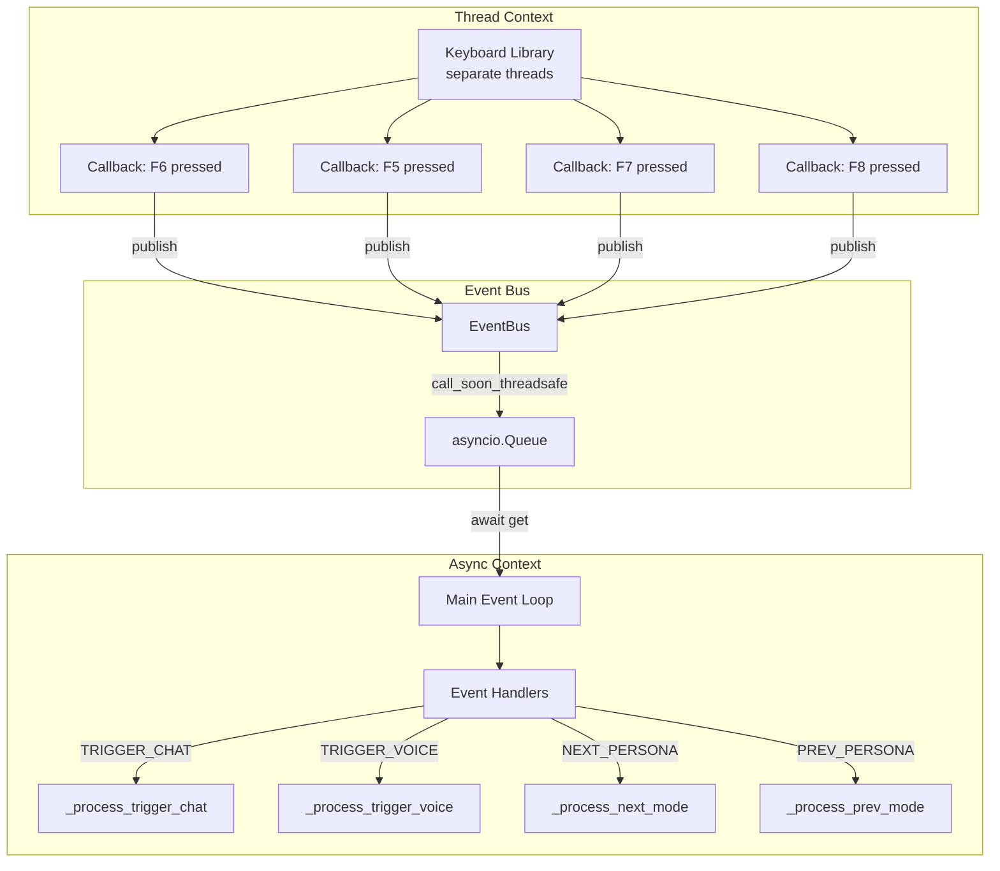

# Event Bus Architecture

The event bus enables thread-safe communication between keyboard callbacks (threads) and the main async event loop.



## Event Types

| Event Type | Trigger | Handler | Description |
|------------|---------|---------|-------------|
| `TRIGGER_CHAT` | F6 | `_process_trigger_chat()` | Generate and type message |
| `TRIGGER_VOICE` | F5 | `_process_trigger_voice()` | Generate and speak message |
| `NEXT_PERSONA` | F8 | `_process_next_mode()` | Switch to next persona |
| `PREV_PERSONA` | F7 | `_process_prev_mode()` | Switch to previous persona |
| `PROMPTS_RELOADED` | File watcher | Log notification | Prompts file changed |
| `SHUTDOWN` | ESC (optional) | Exit loop | Graceful shutdown |

## Thread Safety

### Problem
- Keyboard library runs callbacks in **separate threads**
- Main application runs in **async event loop**
- Direct async calls from threads cause errors

### Solution
The EventBus uses `call_soon_threadsafe` to safely publish events from threads:

```python
def publish(self, event: Event) -> None:
    if self._loop and self._loop.is_running():
        # Thread-safe publish
        self._loop.call_soon_threadsafe(self._queue.put_nowait, event)
```

### Flow
1. Keyboard callback (thread) calls `event_bus.publish(event)`
2. EventBus schedules `queue.put_nowait(event)` on main loop
3. Main loop awaits `queue.get()` and processes events sequentially
4. Async handlers execute without thread conflicts

## Adding New Events

1. **Define event type** in `src/events.py`:
```python
class EventType(Enum):
    MY_EVENT = auto()
```

2. **Publish event** from anywhere:
```python
event_bus.publish(Event(EventType.MY_EVENT, data={"key": "value"}))
```

3. **Handle event** in `src/bot.py`:
```python
elif event.type == EventType.MY_EVENT:
    self._handle_my_event(event.data)
```

## Benefits

- **Decoupling**: Hotkey handling separate from business logic
- **Thread Safety**: No race conditions or async conflicts
- **Extensibility**: Easy to add new events
- **Testability**: Can publish events programmatically for testing

