# Message Generation Flow (Text)

This sequence diagram shows the flow when a user presses the text message hotkey.

```mermaid
sequenceDiagram
    participant User
    participant Keyboard
    participant EventBus
    participant Bot
    participant Observer as Context Observer
    participant Provider
    participant Cache
    participant OpenAI
    participant Analytics
    participant Typer
    participant Game
    
    User->>Keyboard: Press F6 (text hotkey)
    Keyboard->>EventBus: publish(TRIGGER_CHAT)
    
    EventBus->>Bot: get() → TRIGGER_CHAT event
    Bot->>Bot: _process_trigger_chat()
    
    Bot->>Observer: get_context()
    Observer->>Observer: Capture screen ROIs
    Observer->>Observer: Run OCR
    Observer-->>Bot: "KILLFEED: Player eliminated"
    
    Bot->>Provider: get_message(mode="text", context="...")
    
    Provider->>Cache: get(persona, context, mode)
    
    alt Cache Hit
        Cache-->>Provider: Cached message
    else Cache Miss
        Provider->>OpenAI: chat.completions.create(...)
        OpenAI-->>Provider: Generated message + tokens
        Provider->>Analytics: track_api_call(tokens, cost, latency)
        Provider->>Cache: set(message, persona, context, mode)
    end
    
    Provider-->>Bot: "gg ez"
    
    Bot->>Typer: send("gg ez")
    Typer->>Game: Press 'y'
    Typer->>Game: Type characters...
    Typer->>Game: Press 'enter'
    
    Game-->>User: Message appears in chat
```

## Flow Steps

1. **Hotkey Detection**: Keyboard library (running in separate thread) detects F6 press
2. **Event Publishing**: Thread-safe event publishing to async event bus
3. **Event Consumption**: Bot's main async loop receives event
4. **Context Gathering**: Optional - Observer captures game state via OCR
5. **Cache Check**: Check if we've generated similar message recently
6. **API Call**: If not cached, call OpenAI API
7. **Analytics**: Track token usage and cost
8. **Caching**: Save result for future use
9. **Typing**: Simulate keyboard input to send message to game

## Performance Considerations

- **Cache**: Eliminates redundant API calls (TTL: 24h default)
- **Async**: Non-blocking I/O for API calls and typing
- **Threading**: Keyboard callbacks run in separate threads

