# Voice Generation Flow

This sequence diagram shows the flow when a user presses the voice trigger hotkey.

```mermaid
sequenceDiagram
    participant User
    participant Keyboard
    participant EventBus
    participant Bot
    participant Provider
    participant TTS as TTS Engine
    participant ElevenLabs
    participant Analytics
    participant AudioPlayer
    participant VirtualCable
    participant Game
    
    User->>Keyboard: Press F5 (voice hotkey)
    Keyboard->>EventBus: publish(TRIGGER_VOICE)
    
    EventBus->>Bot: get() → TRIGGER_VOICE event
    Bot->>Bot: _process_trigger_voice()
    
    Bot->>Provider: get_message(mode="voice")
    Provider->>Provider: Generate longer message for voice
    Provider-->>Bot: "That was an insane clutch bro!"
    
    Bot->>TTS: synthesize(text)
    
    alt ElevenLabs
        TTS->>ElevenLabs: text_to_speech.convert(text, voice_id)
        ElevenLabs-->>TTS: Audio stream (MP3)
        TTS->>TTS: Save to temp file
        TTS->>Analytics: track_tts(provider, char_count, latency)
    else pyttsx3 (offline)
        TTS->>TTS: Initialize engine
        TTS->>TTS: save_to_file(text, path)
        TTS->>Analytics: track_tts(provider, char_count, latency)
    end
    
    TTS-->>Bot: "/tmp/audio.mp3"
    
    Bot->>AudioPlayer: play(audio_path)
    
    alt Monitor Mode Enabled
        AudioPlayer->>VirtualCable: Stream audio
        AudioPlayer->>AudioPlayer: Also play to default device
        VirtualCable->>Game: Audio input
    else Single Output
        AudioPlayer->>VirtualCable: Stream audio only
        VirtualCable->>Game: Audio input
    end
    
    AudioPlayer->>AudioPlayer: Delete temp file
    AudioPlayer-->>Bot: Playback complete
    
    Game-->>User: Voice heard in-game
```

## Flow Steps

1. **Hotkey Detection**: F5 press detected
2. **Event Publishing**: TRIGGER_VOICE event published
3. **Message Generation**: Provider generates message optimized for voice (longer, more natural)
4. **TTS Synthesis**: 
   - **ElevenLabs**: Cloud API call, high-quality voice
   - **pyttsx3**: Local synthesis, free but robotic
5. **Analytics Tracking**: Track character count, cost, latency
6. **Audio Playback**: 
   - Stream to virtual audio cable (game input)
   - Optionally monitor on default device
7. **Cleanup**: Delete temporary audio file

## Audio Configuration

### Virtual Cable Setup
- **Windows**: VB-Audio Virtual Cable
- **Purpose**: Route audio from bot to game mic input
- **Configuration**: `AUDIO_OUTPUT_DEVICE_NAME` in `.env`

### Monitor Mode
- **Enabled**: `AUDIO_MONITORING=true`
- **Effect**: Hear what the bot says while it plays to game
- **Implementation**: Dual-stream output (virtual cable + default device)

## Cost Considerations

- **ElevenLabs**: ~$0.30 per 1K characters
- **pyttsx3**: Free (offline)
- Analytics tracks all TTS usage and costs in SQLite database

